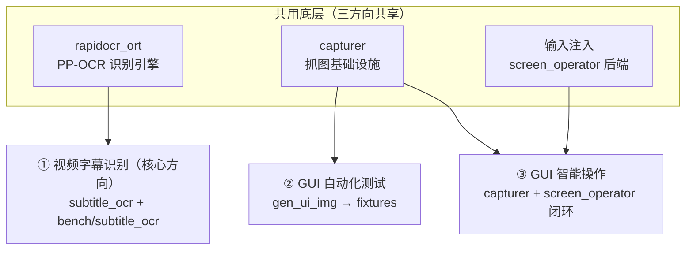

# vision-lab 路线图

## 目标

单仓库聚合**三个强相关的独立目标**（非包含关系，各自有独立交付物与验收）：

1. **视频字幕识别**（核心方向）：从视频帧抽取字幕文字。由通用 OCR 能力孵化出的
   垂直场景——字幕水平、底部、高对比的分布契合 PP-OCR，已沉淀专属后处理与时间轴
   合并链路。
   - 实现变体：`packages/subtitle_ocr_cpp`（C++/ORT 直连，已实现）、
     `packages/subtitle_ocr_py`（Python/rapidocr，已实现）、
     `packages/subtitle_ocr`（Rust，已实现 OCR + 后处理 CLI 链）。
   - 横比基准：`tests/bench/subtitle_ocr`（`bin/test.rs` 正确性 + `bin/bench.rs` 性能占位）。
   - 参考素材：`tests/bench/subtitle_ocr/ref/`（video_source.mp4 + ocr_manual.json 人工标注）。
2. **GUI 自动化测试**：可复现 fixture + 识别/操作验证。
   - `tools/gen_ui_img`（gpui 真实渲染 → capturer 抓图）→ `tests/fixtures/ui_*.png`。
3. **GUI 智能操作**：「看屏幕 → 理解 → 操作」闭环。
   - 组合：`crates/capturer`（抓图）+ `crates/rapidocr_ort`（文字识别）+ `crates/screen_operator`（点击/输入回灌）。

三者共享底层 OCR 引擎与抓图/注入设施（故同仓），但**视频字幕识别的基准只服务字幕识别，
不可误用作 GUI 自动化测试 / GUI 智能操作的验收**。



## 当前状态

### ✅ rapidocr_ort（文字识别，可用）

- `OcrEngine` 支持 v3 / v6-tiny / v6-medium，**运行时 `--model` 切换**（非条件编译）。
- 检测：DB 概率图 + 二值化 + 连通域 + 框扩张（PP-OCR det 概率图只激活文字行
  中间带，需外扩才能包住完整字形）。
- 识别：CRNN/CTC 贪婪解码，时间轴自动判定 `[1,T,C]` / `[1,C,T]`。
- 二进制 `rapidocr_ort` 对单图输出 JSON（`text` / `score` / `bbox` / `center`）。
- `tests/`：可复现 fixture + `v3_detects_text_on_fixtures` 集成测试。
- `tools/gen_fixtures.py`：用 Noto Sans CJK 生成文字图片（支持中文，避免 tofu）。

### ⚠️ 已知问题 / 待修

- **v3 识别仍会掉字**：长文本中间/末尾字符偶发丢失（32px 输入分辨率限制 +
  框扩张比例敏感）。需继续调参：`--model` 之外，扩张比例可经 `OCR_EXPAND`
  环境变量覆盖调试。
- **中文测试图疑似渲染异常**：`tools/gen_fixtures.py` 用 `.ttc` 字体集合，可能
  取到了非预期 face，导致中文图视觉有问题。需用真实渲染核对（见下）。
- **v6 rec 预处理未完成**：v6 det 工作，但 rec 归一化与 v3 不同，当前为占位
  （0.5/0.5），识别不准，标记实验性。需补 PP-OCRv6 专用预处理。
- `cls` 方向分类已加载未使用（旋转文本待支持）。

## 下一步

细项行动清单（可勾选、按目标分组）见 [todo.md](./todo.md)，本文件只保留大方向与
架构，避免路线图被易过期的长清单拖垮。

概要：目标 1 的 Rust 实现已落地，收尾在 v3 掉字调参、v6 rec 预处理、cls 接入、
三实现横比基准；目标 2/3 在 ui_probe 回灌闭环、opencv 视觉层、可选 yolo 控件检测。

## 抓图基础设施（crates/capturer）

- 自研跨 compositor 抓图 crate，抽象 `Capturer` trait。
- 当前实装后端 `PortalCapturer`：基于 `ashpd` 的 xdg-desktop-portal Screenshot
  （非交互、全屏），抓到文件后在 Rust 里按已知区域裁切。KDE/GNOME/wlroots 都
  实现 portal，写一次通用。
- 预留后端（TODO，按环境接入）：wlroots `zwlr_screencopy_manager_v1`
  （smithay-client-toolkit）、X11（x11rb）、Android(waydroid)。
- 注意：gpui 在 Linux/Wayland 无离屏出 PNG 的官方 API（仅 macOS 有
  `render_scene_to_image`），故走「真窗口 + portal 抓屏」路线。

## 目录结构

```
vision-lab/
├── Cargo.toml              # workspace（crates/*）；[patch.crates-io] 覆盖 gpui 到 zed d88f682
├── ROADMAP.md              # 本文件
├── data/models/rapidocr/        # 权重（gitignore，152M）
├── crates/
│   ├── rapidocr_ort/       # 检测+识别 库 & 二进制（目标 2/3 共用的识别引擎）
│   ├── capturer/           # 自研跨 compositor 抓图基础设施（Capturer trait + portal 后端）
│   ├── screen_operator/    # 操作回灌层（目标 2）
│   ├── util/               # 资源加载（rust-embed 辅助）
│   └── settings/           # 配置（rust-embed 资源）
├── packages/
│   ├── subtitle_ocr_cpp/   # 目标 1：字幕识别 C++ 实现（ocr.test.ts + test.justfile）
│   ├── subtitle_ocr_py/    # 目标 1：字幕识别 Python 实现
│   └── subtitle_ocr/       # 核心方向：字幕识别 Rust 实现（已实现 OCR + 后处理 CLI 链）
├── tools/
│   ├── gen_fixtures.py     # 文字图片生成器（PIL/中文，确定性单元 fixture）
│   └── gen_ui_img/         # gpui 真实渲染 → capturer 抓图 → 存 tests/fixtures/ui_*.png（目标 3）
├── tests/
│   ├── fixtures/           # 测试图（stable1/big1/nat1/zh1/mix1 …；ui_* 为 gpui 生成）
│   ├── .test-frames/       # 正确性测试用的 3 帧（目标 1 跨实现测试源）
│   └── bench/subtitle_ocr/ # 目标 1 横比基准（Cargo 包 bench_subtitle_ocr）
└── assets/                 # 嵌入资源（settings/keymaps）
```
